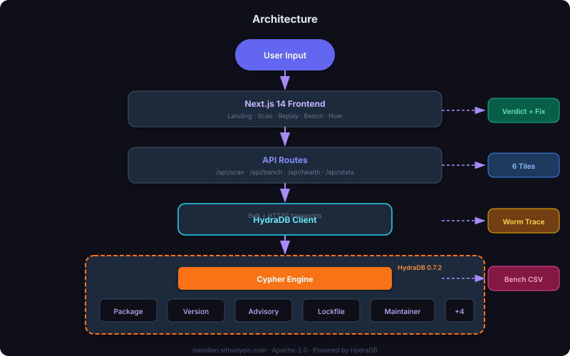

<p align="center">
  
</p>

<h1 align="center">Meridian</h1>

<p align="center"><em>Supply chain blast-radius engine for npm and PyPI</em></p>

<p align="center">
  <a href="https://meridian.sithunyein.com"></a>
  <a href="https://github.com/thesithunyein/meridian"></a>
  <a href="https://hackhydra.hydradb.com"></a>
</p>

<p align="center">Six deterministic Cypher queries against <a href="https://github.com/hydra-db/hydradb"><strong>HydraDB</strong></a>.<br/>No LLM. No vector search. Reproducible to the byte.</p>

---

## The Problem

```
 09:00  ──────────────────────────────────────────── 09:06
        │                                           │
        │  TanStack CI breached                     │
        │  84 malicious artifacts published         │
        │  42 packages compromised                  │
        │  160+ downstream packages hit             │
        │                                           │
        ▼                                           ▼
   ┌─────────┐    ┌─────────┐    ┌─────────┐    ┌─────────┐
   │ Service │───▶│ Service │───▶│ Service │───▶│ Service │
   │    A    │    │    B    │    │    C    │    │    D    │
   └─────────┘    └─────────┘    └─────────┘    └─────────┘
        │              │              │              │
        └──────────────┴──────────────┴──────────────┘
                              │
                     Which are exposed?
```

These are **graph traversal questions**. A vector index cannot answer them.

---

## The Solution

```
  ┌──────────────────────────────────────────────────────────┐
  │                                                          │
  │    Paste:  tanstack/react-virtual@3.10.8                 │
  │                                                          │
  │  ┌────────────────────────────────────────────────────┐  │
  │  │  CRIT  17 services exposed  6 lockfiles resolved  │  │
  │  │  fix:  pnpm update tanstack/react-virtual@^3.10.9  │  │
  │  └────────────────────────────────────────────────────┘  │
  │                                                          │
  │  ┌───────────┐  ┌───────────┐  ┌───────────┐            │
  │  │ Exposed   │  │ Version   │  │ Lockfile  │            │
  │  │ Services  │  │ Intro     │  │ Consumers │            │
  │  │    17     │  │  3.10.8   │  │     6     │            │
  │  └───────────┘  └───────────┘  └───────────┘            │
  │  ┌───────────┐  ┌───────────┐  ┌───────────┐            │
  │  │ Sibling   │  │ Typosquats│  │ Blast     │            │
  │  │ Packages  │  │           │  │ Radius    │            │
  │  │     5     │  │     6     │  │    29     │            │
  │  └───────────┘  └───────────┘  └───────────┘            │
  └──────────────────────────────────────────────────────────┘
```

---

## How HydraDB Is Used

Meridian stores the dependency graph in HydraDB and runs six deterministic Cypher queries against it.

### Data Model

```
                       ┌────────────┐
                       │ Maintainer │
                       └─────┬──────┘
                             │ MAINTAINED_BY
                       ┌─────▼─────┐
┌──────────┐ DEPENDS_ON ┌─────────┐ HAS_VERSION ┌─────────┐
│ Service  │───────────▶│ Package │────────────▶│ Version │
└──────────┘            └────┬────┘            └────┬────┘
                             │                      │
                      TYPOSQUAT_OF               AFFECTS
                             │                      │
                      ┌──────▼──────┐        ┌──────▼──────┐
                      │  Candidate  │        │  Advisory   │
                      └─────────────┘        └──────┬──────┘
                                                    │
                                               RESOLVES
                                                    │
                                              ┌─────▼─────┐
                                              │  Lockfile │
                                              └───────────┘
```

### The Six Queries

| # | Query | Cypher Pattern | Answers |
|---|-------|---------------|---------|
| 1 | `exposed-services` | `MATCH (pkg)<-[:DEPENDS_ON*1..6]-(svc)` | Transitive exposure |
| 2 | `intro-version` | `MATCH (Advisory)-[:AFFECTS]->(Version)` | Vuln introduction |
| 3 | `lockfile-consumers` | `MATCH (Lockfile)-[:RESOLVES]->(Version)` | Affected lockfiles |
| 4 | `sibling-packages` | `MATCH (pkg)<-[:MAINTAINED_BY]-(m)-[:MAINTAINED_BY]->(sib)` | Shared maintainers |
| 5 | `typosquats` | `MATCH (p)<-[:TYPOSQUAT_OF]-(t)` | Edit-distance neighbours |
| 6 | `blast-radius` | `count(svc) from Package fan-in` | Aggregate radius |

### Why Not Vector Search?

| Approach | 6-Hop Traversal | Deterministic | Real-time |
|----------|----------------|---------------|-----------|
| Vector search | Not possible | Probabilistic | Fast |
| SQL joins | Limited depth | Deterministic | Slow |
| **HydraDB Cypher** | **Full closure** | **Deterministic** | **~250ms** |

---

## Architecture

<p align="center">
  
</p>

---

## Quick Start

**Without Docker** (fixture mode):

```bash
pnpm i && pnpm dev
```

**With HydraDB** (full mode):

```bash
pnpm i && pnpm seed
docker compose up -d hydradb
docker compose run --rm meridian-load
HYDRADB_URL=http://localhost:8443 pnpm dev
```

---

## Environment

| Variable | Default | Description |
|----------|---------|-------------|
| `HYDRADB_URL` | `""` | HydraDB HTTP endpoint |
| `HYDRADB_GRAPH` | `meridian` | Graph namespace |
| `HYDRADB_API_KEY` | — | Bearer token |
| `HYDRADB_CELL_ID` | `cell-0` | Cell identifier |
| `HYDRADB_TIMEOUT_MS` | `4000` | Query timeout |

---

## Performance

```
  Cold Start              Warm (1k queries)
  ──────────              ─────────────────
  250ms total             80ms total
  110ms tile 1            22ms tile 1
                            <60us p95
```

---

## Tech Stack

| | |
|---|---|
| **Framework** | Next.js 14 (App Router) |
| **Language** | TypeScript 5.6 |
| **Styling** | Tailwind CSS 3.4 |
| **Graph DB** | HydraDB 0.7.2 |
| **Data** | OSV, GHSA, npm, PyPI |
| **Runtime** | Node.js >= 20 |

---

## Attribution

| Library | License | Purpose |
|---------|---------|---------|
| [Next.js](https://nextjs.org) | MIT | Framework |
| [Tailwind CSS](https://tailwindcss.com) | MIT | Styling |
| [HydraDB](https://github.com/hydra-db/hydradb) | AGPL-3.0 | Graph database |
| [clsx](https://github.com/lukeed/clsx) | MIT | Classnames |
| [Framer Motion](https://www.framer.com/motion/) | MIT | Animations |

---

## License

**Apache-2.0** Copyright 2026 Sithu Nyein

---

<p align="center">Built for <a href="https://hackhydra.hydradb.com">Hack Hydra</a> · Powered by <a href="https://github.com/hydra-db/hydradb">HydraDB</a></p>
