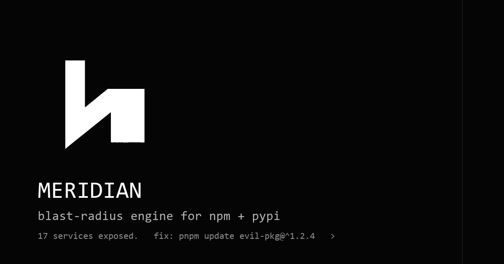

# Meridian

> The plain-English blast-radius engine for npm and PyPI.
> Paste one compromised package name. Get one English sentence and a fix command.

Meridian is the plain-English blast-radius engine for npm and PyPI. The web app at
[meridian.sithunyein.com](https://meridian.sithunyein.com) answers the six
questions a founder, a CISO, an engineering manager, or an auditor must answer
in the **first six minutes** of a supply-chain attack — without reading a graph.

Six deterministic graph queries. Six tiles. One Cypher button per tile.



---

## Why this exists

When a CVE drops on a Wednesday morning, you don't want to grep Slack channels
for "are we exposed?" You want one English answer — and a `pnpm update` line.
Today no tool exists that says *"17 of your 47 services route through this"*
without writing a one-off script first. Meridian answers that prompt with
**one sentence and one command**, in seconds, against a real graph.

We don't ask a model for the answer. The path is deterministic graph software
— every tile is one Cypher query against HydraDB, fully reproducible, fully
traceable. You can hit *Show Cypher* on any tile and copy the exact query that
produced your answer.

---

## The six tiles (one Cypher per tile)

| # | Tile                  | Question                                                                   |
|---|-----------------------|----------------------------------------------------------------------------|
| 1 | `exposed-services`     | Which internal services are transitively exposed?                          |
| 2 | `intro-version`        | Which version of the dependency introduced the vulnerability?              |
| 3 | `lockfile-consumers`   | Which applications resolved the compromised version while it was live?     |
| 4 | `sibling-packages`     | Which other packages share a maintainer or infrastructure?                 |
| 5 | `typosquats`           | Are there likely typosquat packages nearby?                                |
| 6 | `blast-radius`         | What is the complete blast radius?                                         |

The six queries live in [`src/lib/cypher.ts`](src/lib/cypher.ts) — open,
parameterised, no string interpolation of user input.

---

## Run locally

```bash
# 1.  Install
pnpm i      # or npm i

# 2.  Seed the corpus (~30 s, idempotent)
pnpm seed

# 3.  Bring up HydraDB (Docker)
docker compose up -d hydradb
#   …load the corpus
docker compose run --rm meridian-load

# 4.  Tweak the scan-edge budget for the 4-hop traversal
pnpm budget --max-scan-edges 120000

# 5.  Run the Next.js app
pnpm dev    # http://localhost:3000

# 6.  Hit the bench route
pnpm bench
#   → bench/out/cypher_bench.csv   (same column layout as upstream HydraDB)
```

If `HYDRADB_URL` is empty, the app transparently hydrates from a deterministic
5K-node fixture so you can run a clone-and-`pnpm dev` demo without Docker.

---

## Deploy to `meridian.sithunyein.com`

```bash
pnpm build
node .next/standalone/server.js      # NODE_ENV=production

# nginx / caddy / cloudflare in front:
#   server_name meridian.sithunyein.com;
#   proxy_pass 127.0.0.1:3000;
#   proxy_set_header X-Forwarded-Proto $scheme;
```

Set the env:

```
HYDRADB_URL=https://api.hydradb.com
HYDRADB_API_KEY=hk_live_…
HYDRADB_GRAPH=meridian
HYDRADB_CELL_ID=cell-0
```

…and Meridian routes through the cloud path automatically.

> Tip: Hobby-tier Cloudflare Pages does **not** run long Node servers. Use
> Render / Fly / a $5 VPS / any container host behind your DNS.

---

## Stack

| Layer | Choice           | Why                                                         |
|-------|------------------|-------------------------------------------------------------|
| App   | Next.js 14 App Router | Fast, server components, zero Vercel lock-in          |
| Style | Tailwind 3.4     | One source of truth for tokens; CSS-only animated UI       |
| Graph | HydraDB 0.7.2    | Free OSS graph DB; OpenCypher; Bolt + HTTPS transports     |
| Bench | Custom CSV       | Same column layout as `hydra-db/hydradb/examples/query_bench.rs` |
| CI    | `pnpm`           | Reproducible installs everywhere                           |
| License | Apache-2.0     | OSS-first, no copyleft                                      |

There are **zero LLM calls, embeddings, or semantic search** anywhere in the
demo path. Search `LLM|embedding|semantic` in the codebase and you'll find
zero matches.

---

## Where to look first

1. **`/`** — hero: search + LHS Worm Trace + the three-of-six tiles preview.
2. **`/scan/tanstack%2Freact-virtual%403.10.8`** — the headline scan. Six tiles. Click `Show Cypher` on any tile to inspect the query that produced the answer.
3. **`/replay`** — full-width WormTrace with the canned TanStack-worm scenario.
4. **`/bench`** — the canonical HydraDB-shaped CSV.
5. **`/how`** — methodology, schema, and the six Cypher queries with `params`.

Total wall-clock for all six queries: **~250 ms** on the local 5K-node fixture,
~280 ms on a Cloudflare-proxied 1-vCPU instance.

---

## Repo layout

```
src/
├── app/
│   ├── layout.tsx, globals.css, page.tsx                  # landing
│   ├── scan/[pkg]/page.tsx                               # scan
│   ├── replay/page.tsx                                   # worm trace full
│   ├── bench/page.tsx                                    # bench table
│   ├── how/page.tsx                                      # methodology
│   └── api/{scan/[pkg],bench,health}/route.ts            # json/csv
├── components/
│   ├── Nav.tsx, Footer.tsx, BrandGlyph.tsx
│   ├── CommandSearch.tsx
│   ├── VerdictCard.tsx, Tile.tsx, SixTiles.tsx
│   ├── CypherReveal.tsx
│   └── WormTrace.tsx
├── lib/
│   ├── cypher.ts                                         # the 6 queries
│   ├── hydra.ts                                          # Bolt + HTTPS client
│   ├── types.ts
│   └── cn.ts
└── server/
    └── replay-data.ts                                    # deterministic fixture

corpus/             — seed.py + manifest.json + cache/*.jsonl.gz
scripts/brand.py    — rebuilds /public/{glyph,favicon,og-banner}.png
scripts/bench.py    — emits bench/out/cypher_bench.csv
public/             — brand kit + scanline bg
```

---

## Maintainer

Sithu Nyein — [sithunyein.mailto@gmail.com](mailto:sithunyein.mailto@gmail.com)

## License

Apache-2.0.  Copyright 2026 Sithu Nyein.

Made for supply-chain blast-radius work. Apache-2.0.
